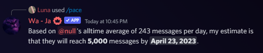

# 🥳 /pace

### Usage

* `user` A Id or mention of the user you want to see, leave blank for yourself.
* `milestone` Enter a custom filestone you want to see, leave blank for the next default one.

<figure><figcaption>
Used /pace on another user
</figcaption></figure>


[leaderboards.md](../utilities/leaderboards.md)


### Features in words

The `/pace` command calculates your average messages per day and **predicts your next milestone based on your past analytics**. This is a very neat tool to fight against your friends in server activity.

### Conclusion

In conclusion, the `/pace` command offered by Waya is an incredibly cool and useful tool for tracking and comparing your server activity. By calculating your average messages per day and predicting your next milestone, it adds a competitive and engaging element to your Discord experience. Whether you want to challenge your friends or simply monitor your own progress, the `/pace` command provides valuable insights into your messaging habits. Stay motivated and strive for new milestones with this innovative feature. Don't miss out on the opportunity to elevate your server activity and make the most out of your Discord journey with Waya's `/pace` command.
