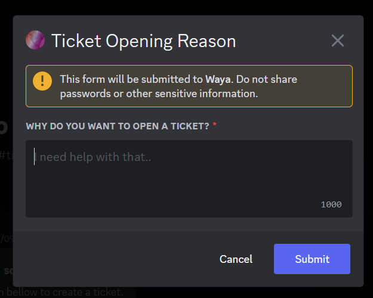

# 🎟 Tickets

## Configure

1. Install Waya on your server by going to [get.waya.one](https://get.waya.one).
2. Run the `/config` command and go to the **Starboard** tab.
3. Set a _#category_ channel. ([Need help?](https://lunish.nl/support))
4. Configure anything as you want, when you're unsure what something does, read below.
5. 🎉 Done!

<figure><figcaption>
Ticket thread example
</figcaption></figure>

## Config Options

### 🌏 Edit Category


**Note:** There is a 500 max channel limit per guild.



**Warning:** There is a 50 channel limit per category, please use ticket threads or `no_category` if you exceed this.


Change the category or channel where tickets should be created at.

* `#category` - Creates a channel in a category.
* `#channel` - Creates a private threat on any text based channel.
* `no_category` - Creates a channel on top of the channel list.


Require bot permissions in the ticket channel/category:\
`ViewChannel`, `SendMessages`, `ReadMessageHistory`, `SendMessages`, `AttachFiles`, `EmbedLinks`, `AddReactions`, `UseExternalEmojis`, `ManageMessages`


### 🧻 Edit Role

Assign a specific staff role that grants access and triggers notifications for new tickets. This role will automatically get the `ManageChannel` permission.

### 🎫 Enable/Disable Open reason

Make it a requirement for members to include a reason when creating a ticket.

### 🧺 Enable/Disable Leave Autoclose

Delete the ticket when the creator leaves the server.

### 🔝 Position: To top/bottom

Modify the placement of newly created tickets relative to existing ones, determining whether they appear at the top or bottom of the list.

### 📃 Change Logging Channel

Create a dedicated channel to keep track of ticket closures and let staff members add a reason when closing a ticket.\
.png>)

### 🎫 Force Reason

Require your staff members to provide a reason when closing a ticket.

### 📜 Save transcript

Generate a `.html` file that captures and preserves all messages exchanged within the ticket. This file is automatically saved and persists even after the ticket is deleted. It is sent to the ticket logs and shared with the ticket creator.\
.png>)


Example transcript


### 🔑 Channel Naming

Chose how new tickets should be named.

* Username: `#ticket-mwlica` (Inappropriate usernames may result in removal from discovery)
* User Id: `#ticket-821472922140803112`
* Random: `#3hvyag`

.png>)

### 🖊  Change (Un)claimd Embed

Customize your whole ticket's message embed for the claimed and unclaimed state! Modify the title, description, thumbnail, image, and even the embed color.\
.png>)

### 🖼 Change Claim/Close Emote

Change the emotes at both the Claim and the Close button. This can be any default Discord emote or a custom emote **from the same server**.\
.png>)

## Commands

A few useful commands for managing tickets.

### 👥 Add a member to a ticket


[wa-add.md](../text-commands/wa-add.md)


### 👤 Remove a member from a ticket


[wa-remove.md](../text-commands/wa-remove.md)


### 📵 Close/Delete a ticket


[wa-close.md](../text-commands/wa-close.md)


### ❓ Request ticket closure


[wa-closerequest.md](../text-commands/wa-closerequest.md)


## Conclusion

Maximize your ticket management with Waya Tickets—a free and highly customizable solution. Unlike other bots, Waya offers extensive customization options, allowing you to tailor your ticketing system to fit your unique needs. Enjoy the freedom to configure categories, channels, and ticket requirements according to your team's preferences. Say goodbye to limitations and costly subscriptions. Choose Waya Tickets for unmatched customization capabilities and elevate your customer support experience.
